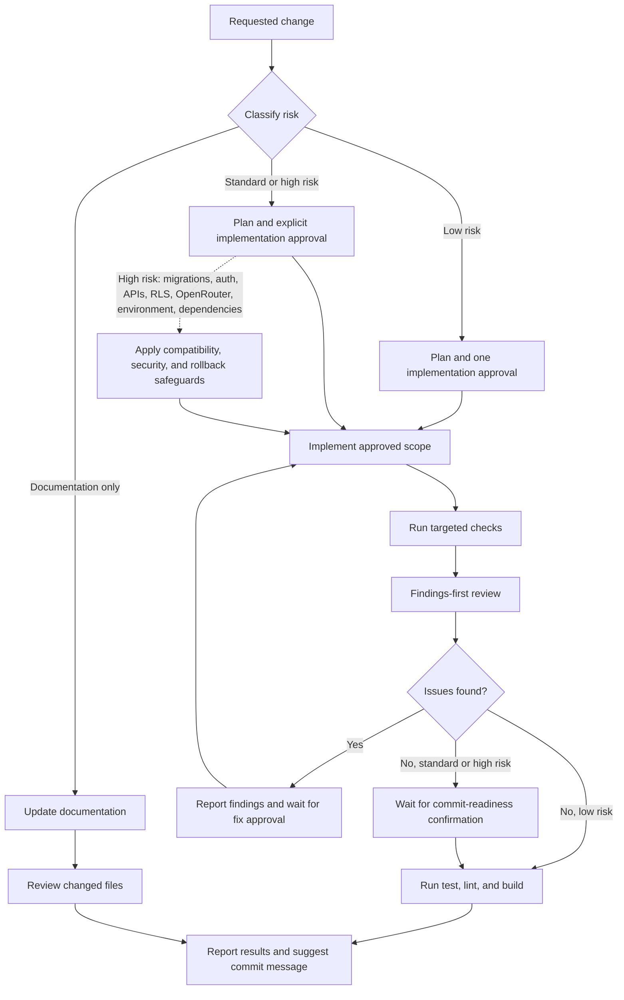

# Coffee Recipe Buddy

Mobile-first coffee recipe generation and recipe tracking built with Next.js 16, React 19, Tailwind CSS v4, Supabase SSR auth/storage, and OpenRouter-backed LLM routes.

Package/app identifier: `crp`

## What it does

- Scan a coffee bag image locally in the browser and extract explicitly labelled bean details
- Generate brew recommendations across supported methods
- Save, revisit, edit, auto-adjust, and share recipes
- Support guest flows with `sessionStorage`, then persist to Supabase after sign-in
- Provide public shared recipe pages with cloning and comments

## App flows

```text
/ -> /scan -> /analysis -> /methods -> /recipe
/ -> /manual -> /methods -> /recipe
/recipes -> /recipes/[id]
/share/[token]
/auth
/settings
```

The app uses the App Router under `src/app`.

## AI agent workflow

Agents follow the repository rules in [`AGENTS.md`](AGENTS.md). The workflow below shows how a request moves from risk classification through validation and handoff.



## Stack

- Next.js `16.2.2`
- React `19.2.4`
- Tailwind CSS v4
- Supabase via `@supabase/ssr`
- Tesseract.js v7 for on-device bag OCR
- Vitest for unit tests

## Environment variables

Copy `.env.example` to `.env.local` and set:

```bash
OPENROUTER_API_KEY=...
OPENROUTER_MODEL=...
OPENROUTER_MODEL_AUTO_ADJUST=...
NEXT_PUBLIC_SUPABASE_URL=...
NEXT_PUBLIC_SUPABASE_ANON_KEY=...
```

OpenRouter model configuration is env-only for the legacy Auto Adjust flow. If `OPENROUTER_MODEL_AUTO_ADJUST` is unset, it inherits `OPENROUTER_MODEL`. If `OPENROUTER_MODEL` is also unset, the app keeps the current default model: `google/gemini-2.5-flash`.

Coffee-bag OCR is self-hosted under `/ocr/v7/`, starts only after the user selects an image, and processes the image in the browser. The compressed color photo is uploaded to Supabase only if the user saves a coffee profile with its image. See [`docs/ocr-assets.md`](docs/ocr-assets.md) for asset versions, licenses, and checksums.

For local development, set these in `.env.local`. For Vercel, add them as project environment variables per environment. Changing a Vercel env var requires a redeploy before the new model selection takes effect.

The settings screen also renders `NEXT_PUBLIC_APP_VERSION`. Set it if you want the in-app version label to be populated, typically to the same value as `package.json`.

## Local development

```bash
npm install
npm run dev
```

Useful scripts:

```bash
npm run build
npm run lint
npm run test
npm run test:watch
```

Open `http://localhost:3000`.

## Supabase notes

This repo uses `@supabase/ssr`, not `@supabase/auth-helpers-nextjs`.

- Browser/client code: `src/lib/supabase/client.ts`
- Server Components and route handlers: `src/lib/supabase/server.ts`
- Session refresh middleware: `src/lib/supabase/middleware.ts`
- Google OAuth names are preserved into `profiles.display_name` from Supabase auth metadata when available

## Key routes

- `POST /api/generate-recipe`
- `POST /api/adjust-recipe`
- `GET|POST /api/recipes`
- `GET|PATCH|DELETE /api/recipes/[id]`
- `POST /api/recipes/[id]/auto-adjust`
- `GET|POST|DELETE /api/recipes/[id]/share`
- `GET /api/share/[token]`
- `GET|POST /api/share/[token]/comments`
- `DELETE /api/share/[token]/comments/[id]`
- `POST /api/share/[token]/clone`
- `GET|PATCH /api/profile`

## OpenRouter tracking

All OpenRouter-backed routes send app attribution headers and a stable `user` identifier for usage analytics.

- Authenticated requests use `crp:<supabase-user-id>`
- Guest requests use `guest:<persistent-cookie-id>`

This is handled centrally in `src/lib/openrouter.ts`.

## Project structure

```text
src/app/                    App Router pages and API routes
src/components/             Shared UI
src/hooks/                  Client hooks
src/lib/                    Recipe engines, migrations, Supabase helpers
src/types/recipe.ts         Zod-backed domain types
phase*.md                   Product/implementation phase specs
```

## Testing

Unit tests live in `src/lib/__tests__` and run with Vitest.
